# Hiero JSON-RPC Relay Proxy

A monorepo containing a dynamic JSON-RPC relay proxy that routes Ethereum requests to different backend servers based on contract addresses. The system uses Hedera Consensus Service for secure route registration and includes cryptographic verification of contract ownership. It consists of two main packages: a proxy server that acts as a JSON-RPC relay with dynamic routing, and a prover client that demonstrates secure route registration.

## 🏗️ Architecture

### Flow 1: Normal JSON-RPC Routing (Daily Operations)

```txt
┌─────────────────┐     ┌─────────────────────────────────────────────────────────┐     ┌─────────────────┐
│   Ethereum      │     │              JSON-RPC Relay PROXY                       │     │   JSON-RPC      │
│   dApps/        │────►│                                                         │────►│   Relay         │
│   Wallets       │     │  1. Receive JSON-RPC Request                            │     │   Servers       │
│   Clients       │     │  2. Extract `to` address from `eth_sendRawTransaction`  │     │                 │
└─────────────────┘     │  3. Lookup address in routes database                   │     │                 │
                        │                                                         │     │                 │
                        │  ┌─────────────────┐  ┌──────────────────┐              │     │                 │
                        │  │ Address Lookup  │  │  Routes Database │              │     │                 │
                        │  │                 │  │   (Verified)     │              │     │                 │
                        │  │ 0x123... ──────►│  │                  │              │     │                 │
                        │  │                 │  │ 0x123 → relay-a  │              │     │                 │
                        │  │                 │  │ 0x456 → relay-b  │              │     │                 │
                        │  └─────────────────┘  │ 0x789 → relay-c  │              │     │                 │
                        │                       └──────────────────┘              │     │                 │
                        │                                                         │     │                 │
                        │  IF FOUND: Route to custom JSON-RPC Relay               │     │ • Custom Relay  │
                        │  IF NOT FOUND: Route to Default (hashio.io)             │     │ • hashio.io     │
                        └─────────────────────────────────────────────────────────┘     └─────────────────┘
```

### Flow 2: Route Registration & Verification

#### Sequence Diagram

```mermaid
sequenceDiagram
  participant Prover as Prover (Contract Owner)
  participant Proxy as Proxy
  participant HCS as HCS

  autonumber
  rect rgb(191, 223, 255)
    Note right of Proxy: Setup
    Proxy ->> Proxy: 🔑 Generate RSA key pair
    Proxy ->> HCS: Create new Paid Topics
    Proxy ->> HCS: Publish RSA Public Key
    Proxy -->> HCS: ⏳ Subscribe to messages
  end
  Prover ->> Proxy: Fetch /status
  Proxy -->> Prover: Answer with Topic ID & RSA Public Key
  Prover ->> Prover: 🔑 Generate AES shared secret key
  Prover ->> HCS: 🔐 Submit Route Data (RSA+AES Encrypted, EcDSA signed), 🤑 Pay Fee
  Prover ->> Prover: ⏳ Listen for Challenge Requests
  HCS -->> Proxy: Deliver Encrypted Message
  Proxy ->> Proxy: Decrypt Message (RSA+AES), Extract AES key
  Proxy ->> Proxy: Verify Signature, Extract Address (EcDSA)
  Proxy ->> Proxy: ✅ Confirm Smart Contract's ownership (Address + Nonce)
  Proxy ->> Prover: 🔐 Send Challenge Request (RSA Signed, AES Encrypted)
  Prover -->> Proxy: 🔐 Respond to Challenge (EcDSA Signed, AES Encrypted)
  Proxy ->> Proxy: Verify Challenge Response, Prover is accessible
  Proxy ->> Proxy: Update Verified Routes Database
  Proxy ->> Prover: 🎉 Confirm Route Registration Success (AES Encrypted)
  rect rgb(255, 191, 191)
    Note over Prover, Proxy: Security Cleanup
    Prover ->> Prover: 🗑️ Remove AES key from memory
    Proxy ->> Proxy: 🗑️ Remove AES key from memory
  end
```




#### Updated Description

1. **Contract Owner (Prover)**:

   - Generates route data, including the contract address and relay information.
   - Creates a shared AES secret key for secure communication with the Proxy.
   - Signs the data using ECDSA and encrypts it using hybrid encryption (RSA for AES key + AES for payload).
   - Submits the encrypted message to the Hedera topic.
   - Maintains the AES key in memory for subsequent encrypted communications.

2. **Hedera Consensus Service**:

   - Acts as a secure message relay, delivering the encrypted message to the Proxy.

3. **JSON-RPC Relay Proxy**:

   - Decrypts the message using its RSA private key to extract the AES key.
   - Uses the AES key to decrypt the route data payload.
   - Verifies the ECDSA signature to ensure authenticity.
   - Validates the route data and updates the verified route database.
   - Sends encrypted challenge requests to the Prover using the shared AES key.
   - Verifies encrypted challenge responses from the Prover.
   - Sends encrypted confirmation of successful route registration.
   - Removes the AES key from memory after successful completion.

4. **Security Features**:

   - **Hybrid Encryption**: RSA encrypts the AES key, AES encrypts all communication payloads.
   - **Shared Secret**: AES key enables secure bidirectional communication.
   - **Memory Cleanup**: Both Proxy and Prover remove the AES key after completion.
   - **Forward Secrecy**: Each registration session uses a unique AES key.
   - Verifies the ECDSA signature to ensure authenticity.
   - Validates the route data and updates the verified route database.
   - Sends a challenge request to the Prover to verify its availability.
   - Verifies the Prover's challenge response.
   - Confirms the successful route registration to the Prover.

### Flow Overview

#### Flow 1: Normal Operations

1. **JSON-RPC Request**: dApps/wallets send requests to the proxy
2. **Address Extraction**: Proxy extracts "to" address from `eth_sendRawTransaction`
3. **Route Lookup**: Check if address exists in verified route database
4. **Routing Decision**: Route to custom relay if found, otherwise default to hashio.io

#### Flow 2: Route Registration Process

1. **Contract Address Generation**: Owner generates deterministic address (deployer + nonce)
2. **Cryptographic Proof**: Signs route data with ECDSA to prove ownership
3. **Secure Submission**: Encrypts and submits route data to Hedera Consensus Service
4. **Message Processing**: Proxy decrypts, verifies signatures, and validates ownership
5. **Challenge-Response**: Proxy challenges the claimed JSON-RPC endpoint URL
6. **Verification**: Prover responds with ECDSA signature to prove control of endpoint
7. **Route Activation**: Successful verification adds route to database and sends confirmation

## 📦 Packages

### [@hiero-json-rpc-relay/proxy](./packages/proxy)

The main JSON-RPC relay proxy server that:

- **Acts as a JSON-RPC relay proxy** routing Ethereum requests to appropriate backend servers
- **Analyzes transaction "to" addresses** from `eth_sendRawTransaction` calls to determine routing
- **Maintains dynamic routing table** mapping contract addresses to specific JSON-RPC relay endpoints
- **Provides fallback routing** to default JSON-RPC relay (e.g., hashio.io) for unregistered addresses
- **Manages secure route registration** via verified Hedera Consensus Service messages
- **Handles RSA hybrid encryption** for secure message communication on Hedera topics
- **Verifies contract ownership** through deterministic address computation and ECDSA signatures
- **Implements challenge-response verification** for URL reachability and endpoint validation
- **Sends direct HTTP confirmation** to provers upon successful route verification
- **Provides status and management endpoints** for monitoring and configuration

**Key Features**:

- Dynamic address-based routing for Ethereum JSON-RPC requests
- Secure route registration through Hedera Consensus Service
- Cryptographic proof of contract ownership required for route updates
- HTTP route update endpoints removed for security (all updates via Hedera only)

**Security**: Route updates can only be done through verified Hedera messages with cryptographic proof of contract ownership and challenge-response verification. HTTP route update endpoints have been removed for security.

### [@hiero-json-rpc-relay/prover](./packages/prover)

A demonstration client that shows the complete route registration flow for JSON-RPC relay endpoints:

- **Fetches proxy configuration** and RSA public keys from proxy status endpoints
- **Creates route registration payloads** mapping contract addresses to JSON-RPC relay endpoints
- **Generates deterministic contract addresses** using CREATE deployment parameters (deployer + nonce)
- **Signs route data with ECDSA** for ownership verification (signs `addr+proofType+nonce+url`)
- **Encrypts messages using RSA** hybrid encryption (RSA + AES) for secure Hedera transmission
- **Submits encrypted route data to Hedera topics** for proxy processing
- **Starts HTTP challenge server** to respond to proxy verification requests
- **Handles challenge-response verification** automatically with ECDSA signature responses
- **Receives direct confirmation** from proxy upon successful route verification
- **Saves comprehensive results** to timestamped JSON files and exits automatically

**Purpose**: Demonstrates how contract owners can securely register their preferred JSON-RPC relay endpoints with the proxy, enabling custom routing for their contract interactions.

## 🚀 Quick Start

### Prerequisites

- Node.js 18.0.0 or higher
- Hedera testnet account with HBAR balance
- Ethereum JSON-RPC endpoint (optional, for testing)

### Installation

```bash
# Clone the repository
git clone https://github.com/your-username/hiero-json-rpc-relay-proxy.git
cd hiero-json-rpc-relay-proxy

# Install all dependencies
npm install

# Or install for specific packages
npm install --workspaces
```

### Configuration

1. **Configure the Proxy** (required):

   ```bash
   cd packages/proxy
   cp .env.example .env
   # Edit .env with your Hedera credentials
   ```

2. **Configure the Prover** (optional for demo):

   ```bash
   cd packages/prover
   cp .env.example .env
   # Edit .env with your Hedera credentials
   ```

### Running the System

1. **Start the Proxy Server**:

   ```bash
   npm run start
   # or
   npm run proxy
   ```

2. **Run the Prover** (in another terminal):

   ```bash
   npm run prover
   ```

3. **Test the Proxy**:

   ```bash
   # Check status
   curl http://localhost:3000/status

   # Test JSON-RPC
   curl -X POST http://localhost:3000 \
     -H "Content-Type: application/json" \
     -d '{"jsonrpc":"2.0","method":"eth_blockNumber","params":[],"id":1}'
   ```

## 🧪 Testing

### Run All Tests

```bash
# All packages + integration tests
npm run test:all

# Individual packages
npm run test:proxy
npm run test:prover

# Integration tests only
npm run test:integration
```

### Test Coverage

```bash
# Coverage for all packages
npm test -- --experimental-test-coverage

# Package-specific coverage
npm run test:coverage --workspace=packages/proxy
npm run test:coverage --workspace=packages/prover
```

## 📋 Available Scripts

| Script                     | Description                          |
| -------------------------- | ------------------------------------ |
| `npm start`                | Start the proxy server               |
| `npm run proxy`            | Start the proxy server               |
| `npm run prover`           | Run the prover client                |
| `npm run dev`              | Start proxy in development mode      |
| `npm test`                 | Run all package tests                |
| `npm run test:proxy`       | Run proxy tests only                 |
| `npm run test:prover`      | Run prover tests only                |
| `npm run test:integration` | Run integration tests                |
| `npm run test:all`         | Run all tests including integration  |
| `npm run clean`            | Clean the routing database           |
| `npm run clean:all`        | Clean all node_modules and databases |

## 🔧 Development

### Project Structure

```
hiero-json-rpc-relay-proxy/
├── packages/
│   ├── proxy/                 # Proxy server package
│   │   ├── src/              # Source code
│   │   ├── test/             # Unit and integration tests
│   │   ├── data/             # Routing database
│   │   └── package.json      # Package configuration
│   └── prover/               # Prover client package
│       ├── src/              # Source code
│       ├── test/             # Unit and integration tests
│       └── package.json      # Package configuration
├── test/                     # Cross-package integration tests
├── scripts/                  # Utility scripts
├── package.json              # Workspace configuration
└── README.md                 # This file
```

### Adding New Features

1. **For Proxy Features**:

   ```bash
   cd packages/proxy
   # Add your feature to src/
   # Add tests to test/
   npm test
   ```

2. **For Prover Features**:

   ```bash
   cd packages/prover
   # Add your feature to src/
   # Add tests to test/
   npm test
   ```

3. **For Integration Features**:

   ```bash
   # Add tests to test/
   npm run test:integration
   ```

## 🔐 Security Considerations

### RSA Key Management

- Private keys are generated automatically and stored securely
- Public keys are exposed via the status endpoint
- Key rotation is supported but requires manual intervention

### Message Validation

- All routing messages must be signed with valid ECDSA signatures
- Encryption ensures message confidentiality
- Replay protection through timestamp validation

## 🔐 Security Features

### Contract Ownership Verification

The proxy now includes robust security features to ensure only legitimate contract owners can register routing endpoints:

#### 1. Deterministic Address Computation

- Uses CREATE deployment pattern with `deployer_address + nonce`
- Computes expected contract addresses using `ethers.getContractAddress()`
- Verifies that the provided address matches the computed address

#### 2. ECDSA Signature Verification

- Route registrations must be signed by the contract deployer
- Signature covers: `addr + proofType + nonce + url`
- Uses `ethers.verifyMessage()` for signature recovery and validation

#### 3. New Payload Format

```json
{
  "routes": [
    {
      "addr": "0x3ed660420aa9bc674e8f80f744f8062603da385e",
      "proofType": "create",
      "nonce": 33,
      "url": "http://localhost:7546",
      "sig": "0x1234567890abcdef..."
    }
  ]
}
```

#### 4. Supported Proof Types

- **CREATE**: Standard contract deployment (implemented)
- **CREATE2**: Deterministic deployment (planned - see TODO.md)

### Network Security

- Use HTTPS in production environments
- Implement proper firewall rules
- Monitor Hedera topic access patterns

## 🐛 Troubleshooting

### Common Issues

1. **Proxy won't start**:

   - Check Hedera credentials in `.env`
   - Verify network connectivity
   - Ensure port 3000 is available

2. **Prover can't connect**:

   - Verify proxy is running (`curl http://localhost:3000/status`)
   - Check prover `.env` configuration
   - Confirm Hedera credentials are valid

3. **Tests failing**:
   - Run `npm run clean:all` and reinstall
   - Check Node.js version (requires 18+)
   - Verify test environment variables

### Debug Mode

Enable detailed logging:

```bash
DEBUG=* npm start        # All debug logs
DEBUG=proxy:* npm start  # Proxy logs only
DEBUG=prover:* npm run prover  # Prover logs only
```

## 📄 License

Apache-2.0 - See [LICENSE](./LICENSE) file for details.

## 🤝 Contributing

1. Fork the repository
2. Create a feature branch
3. Add tests for new functionality
4. Ensure all tests pass
5. Submit a pull request

## 📞 Support

For issues and questions:

- Create an issue on GitHub
- Check the troubleshooting section
- Review package-specific READMEs
