# Hiero JSON-RPC Relay Proxy

A monorepo containing a dynamic JSON-RPC relay proxy that routes Ethereum requests to different backend servers based on contract addresses. The system uses Hedera Consensus Service for secure route registration and includes cryptographic verification of contract ownership. It consists of three main packages: a common utilities package, a proxy server that acts as a JSON-RPC relay with dynamic routing, and a prover client that establishes secure route registration.

## 🚀 Quick Start

### Prerequisites

- **Node.js**: 18.0.0 or higher (required by all packages)
- **npm**: Latest version recommended
- Hedera testnet account with HBAR balance:
  - **Proxy Account**: Minimum 25 HBAR (for HIP-991 topic creation)
  - **Prover Account**: Minimum 1 HBAR (for $0.50 submission fees)
- Ethereum JSON-RPC endpoint (optional, for testing)

### Installation

```bash
# Clone the repository
git clone https://github.com/your-username/hiero-json-rpc-relay-proxy.git
cd hiero-json-rpc-relay-proxy

# Install all dependencies for all packages
npm install

# Install pre-commit hooks (recommended for contributors)
npm run install:hooks

# Alternative: Install for specific packages only
npm install --workspace=packages/common
npm install --workspace=packages/proxy
npm install --workspace=packages/prover
```

### Configuration

1. **Configure the Proxy** (required):

   ```bash
   cd packages/proxy
   cp .env.example .env
   # Edit .env with your Hedera credentials
   # Ensure account has ≥25 HBAR for topic creation
   ```

2. **Configure the Prover** (optional for demo):

   ```bash
   cd packages/prover
   cp .env.example .env
   # Edit .env with your Hedera credentials
   # Ensure account has ≥1 HBAR for submission fees
   ```

   **Advanced Topic Configuration**: The prover supports flexible topic ID configuration:

   - **Use Proxy's Topic** (default): Don't set `PROVER_HEDERA_TOPIC_ID` - the prover will fetch and use whatever topic the proxy is configured to use
   - **Override with Specific Topic**: Set `PROVER_HEDERA_TOPIC_ID=0.0.1234567` to use a specific topic regardless of what the proxy advertises

   This allows testing with different topics while still maintaining compatibility with the proxy's RSA public key.

3. **Common Package**: The `@hiero-json-rpc-relay/common` package is automatically installed as a dependency for both proxy and prover packages. It provides shared utilities for:
   - Cryptographic operations (RSA+AES encryption, ECDSA signing)
   - HTTP request/response handling
   - Route signature validation
   - Environment variable loading
   - Hedera integration utilities

### Running the System

1. **Start the Proxy Server**:

   ```bash
   # From workspace root
   npm run proxy

   # Or from proxy package directory
   cd packages/proxy
   npm start

   # Development mode with auto-restart
   npm run proxy:dev
   ```

2. **Run the Prover** (in another terminal):

   ```bash
   # From workspace root
   npm run prover

   # Or from prover package directory
   cd packages/prover
   npm start
   ```

3. **Test the Proxy**:

   ```bash
   # Check status
   curl http://localhost:3000/status

   # Test JSON-RPC
   curl -X POST http://localhost:3000 \
     -H "Content-Type: application/json" \
     -d '{"jsonrpc":"2.0","method":"eth_blockNumber","params":[],"id":1}'
   ```

## 🏗️ Architecture

### Flow 1: Normal JSON-RPC Routing (Daily Operations)

```text
┌──────────┐    ┌──────────────────────────────────────────────────┐     ┌────────────────┐
│ Ethereum │    │              JSON-RPC Relay PROXY                │     │   JSON-RPC     │
│ dApps/   │───►│                                                  │────►│   Relay        │
│ Wallets  │    │  1. Receive JSON-RPC Request                     │     │   Servers      │
│ Clients  │    │  2. Extract `to` from `eth_sendRawTransaction`   │     │                │
└──────────┘    │  3. Lookup address in routes database            │     │                │
                │                                                  │     │                │
                │  ┌─────────────────┐  ┌──────────────────┐       │     │                │
                │  │ Address Lookup  │  │  Routes Database │       │     │                │
                │  │                 │  │   (Verified)     │       │     │                │
                │  │ 0x123... ──────►│  │                  │       │     │                │
                │  │                 │  │ 0x123 → relay-a  │       │     │                │
                │  │                 │  │ 0x456 → relay-b  │       │     │                │
                │  └─────────────────┘  │ 0x789 → relay-c  │       │     │                │
                │                       └──────────────────┘       │     │                │
                │                                                  │     │ • hashio.io    │
                |  IF FOUND: Route to custom JSON-RPC Relay        │     │ • example.com  |
                |                                                  │     | • acme.org     |
                │  IF NOT FOUND: Route to Default (hashio.io)      │     │ • ...          │
                └──────────────────────────────────────────────────┘     └────────────────┘
```

### Flow 2: Route Registration & Verification

#### Sequence Diagram

[Click here if you don't see the graphical Mermaid flow](docs/flow2.svg)

```mermaid
sequenceDiagram
  participant Prover as Prover (Contract Owner)
  participant Proxy as Proxy
  participant HCS as HCS

  autonumber
  rect rgb(191, 223, 255)
    Note right of Proxy: Setup
    Proxy ->> Proxy: 🔑 Generate RSA key pair
    Proxy ->> HCS: Create new HIP-991 Paid Topic ($1 submission fee)
    Proxy ->> HCS: Publish RSA Public Key (proxy exempt from fees)
    Proxy -->> HCS: ⏳ Subscribe to messages
  end
  Prover ->> Proxy: Fetch /status
  Proxy -->> Prover: Answer with Topic ID & RSA Public Key
  Prover ->> Prover: 🔑 Generate AES shared secret key
  Prover ->> HCS: 🔐 Submit Route Data (RSA+AES Encrypted, ECDSA signed), 💰 Pay $1 Topic Fee
  Prover ->> Prover: ⏳ Listen for Challenge Requests
  HCS -->> Proxy: Deliver Encrypted Message
  Proxy ->> Proxy: Decrypt Message (RSA+AES), Extract AES key
  Proxy ->> Proxy: Verify Signature, Extract Address (ECDSA)
  Proxy ->> Proxy: ✅ Confirm Smart Contract's ownership (Address + Nonce)
  Proxy ->> Prover: 🔐 Send Challenge Request (RSA Signed, AES Encrypted)
  Prover -->> Proxy: 🔐 Respond to Challenge (ECDSA Signed, AES Encrypted)
  Proxy ->> Proxy: Verify Challenge Response, Prover is accessible
  Proxy ->> Proxy: Update Verified Routes Database
  Proxy ->> Prover: 🎉 Confirm Route Registration Success (AES Encrypted)
  rect rgb(255, 191, 191)
    Note over Prover, Proxy: Security Cleanup
    Prover ->> Prover: 🗑️ Remove AES key from memory
    Proxy ->> Proxy: 🗑️ Remove AES key from memory
  end
```



#### Updated Description

1. **Contract Owner (Prover)**:

   - Generates route data, including the contract address and relay information.
   - Creates a shared AES secret key for secure communication with the Proxy.
   - Signs the data using ECDSA and encrypts it using hybrid encryption (RSA for AES key + AES for payload).
   - Submits the encrypted message to the Hedera topic.
   - Maintains the AES key in memory for subsequent encrypted communications.

2. **Hedera Consensus Service**:

   - Acts as a secure message relay, delivering the encrypted message to the Proxy.
   - **HIP-991 Paid Topics**: Implements $0.50 USD equivalent submission fee (0.5 HBAR) to prevent spam.
   - **Fee Collection**: Proxy collects submission fees as topic creator and fee collector.
   - **Fee Exemption**: Proxy is exempt from submission fees via fee exempt key.

3. **JSON-RPC Relay Proxy**:

   - Decrypts the message using its RSA private key to extract the AES key.
   - Uses the AES key to decrypt the route data payload.
   - Verifies the ECDSA signature to ensure authenticity.
   - Validates the route data and updates the verified route database.
   - Sends encrypted challenge requests to the Prover using the shared AES key.
   - Verifies encrypted challenge responses from the Prover.
   - Sends encrypted confirmation of successful route registration.
   - Removes the AES key from memory after successful completion.

4. **Security Features**:

   - **Hybrid Encryption**: RSA encrypts the AES key, AES encrypts all communication payloads.
   - **Shared Secret**: AES key enables secure bidirectional communication.
   - **Memory Cleanup**: Both Proxy and Prover remove the AES key after completion.
   - **Forward Secrecy**: Each registration session uses a unique AES key.
   - Verifies the ECDSA signature to ensure authenticity.
   - Validates the route data and updates the verified route database.
   - Sends a challenge request to the Prover to verify its availability.
   - Verifies the Prover's challenge response.
   - Confirms the successful route registration to the Prover.

### Flow Overview

#### Flow 1: Normal Operations

1. **JSON-RPC Request**: dApps/wallets send requests to the proxy
2. **Address Extraction**: Proxy extracts "to" address from `eth_sendRawTransaction`
3. **Route Lookup**: Check if address exists in verified route database
4. **Routing Decision**: Route to custom relay if found, otherwise default to hashio.io

#### Flow 2: Route Registration Process

1. **Contract Address Generation**: Owner generates deterministic address using either CREATE (deployer + nonce) or CREATE2 (deployer + salt + init code hash)
2. **Cryptographic Proof**: Signs route data with ECDSA to prove ownership
3. **Secure Submission**: Encrypts and submits route data to Hedera Consensus Service
4. **Message Processing**: Proxy decrypts, verifies signatures, and validates ownership
5. **Challenge-Response**: Proxy challenges the claimed JSON-RPC endpoint URL
6. **Verification**: Prover responds with ECDSA signature to prove control of endpoint
7. **Route Activation**: Successful verification adds route to database and sends confirmation

## 💰 HIP-991 Paid Topic Implementation

The system implements **HIP-991 Paid Topics** to prevent spam and ensure quality route registrations. This provides economic security while maintaining decentralized access.

### Topic Economics

- **Submission Fee**: $0.50 USD equivalent (0.5 HBAR) per message submission
- **Fee Purpose**: Prevents spam attacks and ensures serious route registration attempts
- **Fee Collection**: Proxy collects all submission fees as the topic creator
- **Fee Exemption**: Proxy is exempt from fees via fee exempt key for operational messages

### Technical Implementation

#### Proxy (Topic Creator)

- **Creates HIP-991 topic** with custom fixed fee of 0.5 HBAR per submission
- **Exempt from fees** via fee exempt key for publishing RSA public key and confirmations
- **Collects all fees** paid by provers for route registration attempts
- **Sets fee schedule key** to allow future fee adjustments if needed

#### Prover (Message Submitter)

- **Pays 0.5 HBAR fee** automatically when submitting route registration messages
- **Sets custom fee limit** to maximum 0.6 HBAR to account for network fee variations
- **Must have sufficient balance** before attempting route registration
- **Receives route verification** and confirmation after successful payment and validation

### Economic Benefits

1. **Spam Prevention**: 0.5 HBAR cost makes spam attacks economically unfeasible
2. **Quality Assurance**: Only serious projects with genuine intent will pay for registration
3. **Network Sustainability**: Fees support proxy operation and maintenance
4. **Fair Access**: No central gatekeeping - anyone can register by paying the transparent fee
5. **Scalable Economics**: Fee collection scales with usage without additional infrastructure

### Configuration Requirements

```bash
# Proxy must have sufficient balance for topic creation (≥25 HBAR recommended)
PROXY_HEDERA_ACCOUNT_ID=0.0.123456
PROXY_HEDERA_PRIVATE_KEY=302e020100300506032b65700...

# Prover must have sufficient balance for submissions (≥1 HBAR recommended)
PROVER_HEDERA_ACCOUNT_ID=0.0.789012
PROVER_HEDERA_PRIVATE_KEY=0x48b52aba58f4b8dd4cd0e527...
```

## 📦 Packages

### [@hiero-json-rpc-relay/proxy](./packages/proxy)

**Version**: 1.0.0  
**Description**: Ethereum transaction routing proxy with Hedera Consensus Service integration and RSA key management

The main JSON-RPC relay proxy server that:

- **Acts as a JSON-RPC relay proxy** routing Ethereum requests to appropriate backend servers
- **Analyzes transaction "to" addresses** from `eth_sendRawTransaction` calls to determine routing
- **Maintains dynamic routing table** mapping contract addresses to specific JSON-RPC relay endpoints
- **Provides fallback routing** to default JSON-RPC relay (e.g., hashio.io) for unregistered addresses
- **Manages secure route registration** via verified Hedera Consensus Service messages
- **Creates and manages HIP-991 paid topics** with $0.50 submission fee to prevent spam
- **Handles RSA hybrid encryption** for secure message communication on Hedera topics
- **Verifies contract ownership** through deterministic address computation and ECDSA signatures for both CREATE and CREATE2 deployments
- **Implements challenge-response verification** for URL reachability and endpoint validation
- **Sends direct HTTP confirmation** to provers upon successful route verification
- **Provides status and management endpoints** for monitoring and configuration

**Key Features**:

- Dynamic address-based routing for Ethereum JSON-RPC requests
- Secure route registration through Hedera Consensus Service
- Cryptographic proof of contract ownership required for route updates
- HTTP route update endpoints removed for security (all updates via Hedera only)

**Security**: Route updates can only be done through verified Hedera messages with cryptographic proof of contract ownership and challenge-response verification. HTTP route update endpoints have been removed for security.

### [@hiero-json-rpc-relay/prover](./packages/prover)

**Version**: 1.0.0  
**Description**: Hedera prover component for sending encrypted messages to Hedera Consensus Service

A demonstration client that shows the complete route registration flow for JSON-RPC relay endpoints:

- **Fetches proxy configuration** and RSA public keys from proxy status endpoints
- **Creates route registration payloads** mapping contract addresses to JSON-RPC relay endpoints
- **Generates deterministic contract addresses** using CREATE deployment parameters (deployer + nonce) or CREATE2 parameters (deployer + salt + init code hash)
- **Signs route data with ECDSA** for ownership verification (signs `addr+proofType+nonce+url` for CREATE or `addr+proofType+salt+url` for CREATE2)
- **Encrypts messages using RSA** hybrid encryption (RSA + AES) for secure Hedera transmission
- **Submits encrypted route data to Hedera topics** for proxy processing
- **Pays HIP-991 topic submission fees** automatically (0.5 HBAR per registration)
- **Starts HTTP challenge server** to respond to proxy verification requests
- **Handles challenge-response verification** automatically with ECDSA signature responses
- **Receives direct confirmation** from proxy upon successful route verification
- **Saves comprehensive results** to timestamped JSON files and exits automatically

**Purpose**: Demonstrates how contract owners can securely register their preferred JSON-RPC relay endpoints with the proxy, enabling custom routing for their contract interactions.

### [@hiero-json-rpc-relay/common](./packages/common)

**Version**: 1.0.0  
**Description**: Common utilities and shared code for the Hiero JSON-RPC Relay system

A shared utility package providing common functionality used by both proxy and prover packages:

- **RSA key management** for key generation, validation, and metadata handling
- **Cryptographic utilities** for RSA/AES encryption, decryption, and ECDSA signature verification
- **Database utilities** for persistent storage, migration, and route management
- **Environment variable management** with validation and secure configuration loading
- **Route signature validation** with comprehensive error reporting and batch validation
- **HTTP utilities** for request parsing, CORS handling, and server creation helpers
- **Hedera utilities** for client initialization, ID validation, and timestamp conversion
- **Message utilities** for parsing, chunking, and validation of Hedera topic messages
- **Ethereum utilities** for transaction decoding and address validation
- **Validation functions** for contract addresses, configuration, and data integrity checks

**Key Components**:

- **cryptoUtils**: RSA key generation, AES encryption/decryption, signature verification
- **databaseUtils**: Database path management, migration, and persistence
- **envLoader**: Environment variable loading with validation and defaults
- **validation**: Route signature validation and error handling
- **httpUtils**: HTTP request parsing, CORS, and server utilities
- **hederaUtils**: Hedera client setup and utility functions
- **messageUtils**: Message parsing, chunking, and validation
- **ethUtils**: Ethereum transaction decoding and address utilities

**Benefits**: Centralizes common functionality, reduces code duplication, ensures consistent behavior across packages, and provides comprehensive test coverage for all shared utilities.

### Package Diagram

```text
┌─────────────┐    ┌─────────────┐
│   Proxy     │    │   Prover    │
│  Package    │    │  Package    │
└──────┬──────┘    └──────┬──────┘
       │                  │
       │                  │
       └────────┬─────────┘
                │
         ┌──────▼──────┐
         │   Common    │
         │  Package    │
         │ (utilities) │
         └─────────────┘
```

## 📁 Project Structure

```text
hiero-json-rpc-relay-proxy/
├── packages/
│   ├── common/                     # 📦 Shared utilities and components
│   │   ├── src/
│   │   │   ├── cryptoUtils.js      # RSA+AES encryption, ECDSA signing
│   │   │   ├── envLoader.js        # Environment variable loading
│   │   │   ├── hederaUtils.js      # Hedera SDK utilities
│   │   │   ├── httpUtils.js        # HTTP request/response handling
│   │   │   ├── validation.js       # Route signature validation
│   │   │   └── index.js            # Main exports
│   │   └── test/                   # Unit tests for common utilities
│   ├── proxy/                      # 🔀 JSON-RPC relay proxy server
│   │   ├── src/
│   │   │   ├── proxy.js            # Main proxy server
│   │   │   ├── hederaManager.js    # Hedera integration
│   │   │   ├── dbManager.js        # Route database management
│   │   │   └── ethTxDecoder.js     # Ethereum transaction parsing
│   │   └── test/                   # Proxy-specific tests
│   └── prover/                     # 🔐 Route registration client
│       ├── src/
│       │   ├── prover.js           # Main prover client
│       │   └── hederaManager.js    # Hedera integration for prover
│       └── test/                   # Prover-specific tests
├── docs/                           # 📚 Documentation
├── test/                           # 🧪 Integration tests
└── scripts/                       # 🛠️ Utility scripts
```

## 🧪 Testing

### Run All Tests

```bash
# All packages + integration tests (from workspace root)
npm test

# Individual package tests
npm run test:common
npm run test:proxy
npm run test:prover

# Integration tests only
npm run test:integration

# Test individual packages from their directories
cd packages/common && npm test
cd packages/proxy && npm test
cd packages/prover && npm test
```

### Test Coverage

```bash
# Coverage for individual packages
npm run test:coverage --workspace=packages/common
npm run test:coverage --workspace=packages/proxy
npm run test:coverage --workspace=packages/prover

# Run coverage from package directories
cd packages/common && npm run test:coverage
cd packages/proxy && npm run test:coverage
cd packages/prover && npm run test:coverage
```

## 📋 Available Scripts

### Workspace Scripts (from root)

| Script                     | Description                         |
| -------------------------- | ----------------------------------- |
| `npm run proxy`            | Start the proxy server              |
| `npm run proxy:dev`        | Start proxy in development mode     |
| `npm run prover`           | Run the prover client               |
| `npm run prover:dev`       | Run prover in development mode      |
| `npm test`                 | Run all package tests + integration |
| `npm run test:common`      | Run common utilities tests only     |
| `npm run test:proxy`       | Run proxy tests only                |
| `npm run test:prover`      | Run prover tests only               |
| `npm run test:integration` | Run integration tests only          |
| `npm run test:workspaces`  | Run all workspace package tests     |
| `npm run clean`            | Clean databases and node_modules    |
| `npm run clean:db`         | Clean routing databases only        |
| `npm run format`           | Format all code with Prettier       |
| `npm run format:check`     | Check code formatting               |
| `npm run install:hooks`    | Install git pre-commit hooks        |

### Package-Specific Scripts

#### Common Package (`packages/common`)

| Script                  | Description                    |
| ----------------------- | ------------------------------ |
| `npm test`              | Run unit tests                 |
| `npm run test:watch`    | Run tests in watch mode        |
| `npm run test:coverage` | Run tests with coverage report |

#### Proxy Package (`packages/proxy`)

| Script                     | Description                            |
| -------------------------- | -------------------------------------- |
| `npm start`                | Start the proxy server                 |
| `npm run dev`              | Start in development mode (watch)      |
| `npm test`                 | Run all proxy tests                    |
| `npm run test:unit`        | Run unit tests only (skip integration) |
| `npm run test:integration` | Run integration tests only             |
| `npm run test:watch`       | Run tests in watch mode                |
| `npm run test:coverage`    | Run tests with coverage report         |
| `npm run clean-db`         | Clean proxy database                   |

#### Prover Package (`packages/prover`)

| Script                  | Description                    |
| ----------------------- | ------------------------------ |
| `npm start`             | Run the prover client          |
| `npm test`              | Run all prover tests           |
| `npm run test:watch`    | Run tests in watch mode        |
| `npm run test:coverage` | Run tests with coverage report |

## 🔧 Development

### Project Structure

```text
hiero-json-rpc-relay-proxy/
├── packages/
│   ├── common/                    # 📦 Shared utilities and components
│   │   ├── src/
│   │   │   ├── cryptoUtils.js     # RSA+AES encryption, ECDSA signing
│   │   │   ├── databaseUtils.js   # Database management utilities
│   │   │   ├── envLoader.js       # Environment variable loading
│   │   │   ├── ethUtils.js        # Ethereum transaction utilities
│   │   │   ├── hederaUtils.js     # Hedera SDK utilities
│   │   │   ├── httpUtils.js       # HTTP request/response handling
│   │   │   ├── messageUtils.js    # Message parsing and chunking
│   │   │   ├── validation.js      # Route signature validation
│   │   │   └── index.js           # Main exports
│   │   ├── test/                  # Unit tests for common utilities
│   │   └── package.json           # Package configuration
│   ├── proxy/                     # 🔀 JSON-RPC relay proxy server
│   │   ├── src/
│   │   │   ├── proxy.js           # Main proxy server
│   │   │   ├── hederaManager.js   # Hedera integration
│   │   │   ├── dbManager.js       # Route database management
│   │   │   └── ethTxDecoder.js    # Ethereum transaction parsing
│   │   ├── test/                  # Proxy-specific tests
│   │   ├── data/                  # Database storage
│   │   └── package.json           # Package configuration
│   └── prover/                    # 🔐 Route registration client
│       ├── src/
│       │   ├── prover.js          # Main prover client
│       │   └── hederaManager.js   # Hedera integration for prover
│       ├── test/                  # Prover-specific tests
│       ├── data/                  # Result storage
│       └── package.json           # Package configuration
├── docs/                          # 📚 Documentation
├── test/                          # 🧪 Integration tests
├── scripts/                       # 🛠️ Utility scripts
├── wasteland/                     # 🗑️ Experimental/demo code
└── package.json                   # Workspace configuration
```

### Adding New Features

1. **For Common Utilities**:

   ```bash
   cd packages/common
   # Add your utility to src/
   # Add tests to test/
   # Update exports in src/index.js
   npm test
   ```

2. **For Proxy Features**:

   ```bash
   cd packages/proxy
   # Add your feature to src/
   # Add tests to test/
   npm test
   ```

3. **For Prover Features**:

   ```bash
   cd packages/prover
   # Add your feature to src/
   # Add tests to test/
   npm test
   ```

4. **For Integration Features**:

   ```bash
   # Add tests to test/
   npm run test:integration
   ```

## 🔐 Security Considerations

### RSA Key Management

- Private keys are generated automatically and stored securely
- Public keys are exposed via the status endpoint
- Key rotation is supported but requires manual intervention

### Message Validation

- All routing messages must be signed with valid ECDSA signatures
- Encryption ensures message confidentiality
- Replay protection through timestamp validation

## 🔐 Security Features

### Contract Ownership Verification

The proxy now includes robust security features to ensure only legitimate contract owners can register routing endpoints:

#### 1. Deterministic Address Computation

- **CREATE deployment**: Uses `deployer_address + nonce` pattern with `ethers.getCreateAddress()`
- **CREATE2 deployment**: Uses `deployer_address + salt + init_code_hash` pattern with `ethers.getCreate2Address()`
- Computes expected contract addresses and verifies they match the provided address

#### 2. ECDSA Signature Verification

- Route registrations must be signed by the contract deployer
- **CREATE signature**: Covers `addr + proofType + nonce + url`
- **CREATE2 signature**: Covers `addr + proofType + salt + url`
- Uses `ethers.verifyMessage()` for signature recovery and validation

#### 3. Enhanced Payload Format

The proxy supports both CREATE and CREATE2 deployment proofs:

```json
{
  "routes": [
    {
      "addr": "0x3ed660420aa9bc674e8f80f744f8062603da385e",
      "proofType": "create",
      "nonce": 33,
      "url": "http://localhost:7546",
      "sig": "0x1234567890abcdef..."
    },
    {
      "addr": "0x8ba1f109551bd432803012645hac136c5edf4aef",
      "proofType": "create2",
      "salt": "0x0000000000000000000000000000000000000000000000000000000000000001",
      "initCodeHash": "0xddf252ad1be2c89b69c2b068fc378daa952ba7f163c4a11628f55a4df523b3ef",
      "url": "http://localhost:7546",
      "sig": "0x9876543210fedcba..."
    }
  ]
}
```

#### 4. Supported Proof Types

- **CREATE**: Standard contract deployment using deployer address and nonce
- **CREATE2**: Deterministic deployment using deployer address, salt, and init code hash
- Both proof types ensure cryptographic verification of contract ownership

### Network Security

- Use HTTPS in production environments
- Implement proper firewall rules
- Monitor Hedera topic access patterns

## 📦 Chunked Message Handling

### Large Message Support

When the prover sends messages larger than 1024 KB to Hedera, the messages are automatically split into multiple chunks. The proxy now supports seamless handling of these chunked messages:

#### Key Features

- **✅ Automatic Detection**: Identifies chunked messages using `chunk_info` field
- **✅ Order Independence**: Assembles chunks correctly regardless of arrival order
- **✅ Group Management**: Uses `transaction_valid_start` to group related chunks
- **✅ Error Handling**: Validates chunk totals and handles mismatched chunks
- **✅ Automatic Cleanup**: Expires old chunk groups to prevent memory leaks
- **✅ Backward Compatibility**: Works seamlessly with existing message processing

#### How It Works

1. **Detection**: Proxy detects chunked messages by checking for `chunk_info` field
2. **Grouping**: Messages are grouped by `transaction_valid_start` timestamp
3. **Assembly**: When all chunks are received, they are combined in correct order
4. **Processing**: Combined message is processed normally (decryption, verification, etc.)

#### Example Chunk Structure

```json
{
  "chunk_info": {
    "initial_transaction_id": {
      "transaction_valid_start": "1749506740.674505590"
    },
    "number": 1,
    "total": 2
  },
  "message": "base64-encoded-chunk-content",
  "sequence_number": 2
}
```

For detailed implementation information, see [docs/chunked-messages.md](./docs/chunked-messages.md).

## 🐛 Troubleshooting

### Common Issues

1. **Proxy won't start**:

   - Check Hedera credentials in `.env`
   - Verify account has ≥25 HBAR for topic creation
   - Verify network connectivity
   - Ensure port 3000 is available

2. **Prover can't connect**:

   - Verify proxy is running (`curl http://localhost:3000/status`)
   - Check prover `.env` configuration
   - Confirm Hedera credentials are valid

3. **HIP-991 Topic Issues**:

   - **Insufficient Balance**: Ensure proxy account has ≥25 HBAR for topic creation
   - **Submission Failed**: Ensure prover account has ≥1 HBAR for submission fees
   - **Fee Limit Exceeded**: Check account balance and increase HBAR if needed
   - **Topic Not Found**: Verify topic ID in configuration matches created topic

4. **Route Submission Failures**:

   - **Payment Required**: Verify prover account has sufficient HBAR balance
   - **Custom Fee Error**: Check network status and retry with higher fee limit
   - **Balance Too Low**: Add HBAR to prover account for submission fees

5. **Tests failing**:
   - Run `npm run clean:all` and reinstall
   - Check Node.js version (requires 18+)
   - Verify test environment variables

### Debug Mode

Enable detailed logging:

```bash
DEBUG=* npm start        # All debug logs
DEBUG=proxy:* npm start  # Proxy logs only
DEBUG=prover:* npm run prover  # Prover logs only
```

## 📄 License

Apache-2.0 - See [LICENSE](./LICENSE) file for details.

## 🤝 Contributing

1. Fork the repository
2. Create a feature branch
3. **Set up pre-commit hooks** (recommended):

   ```bash
   npm run install:hooks
   ```

   This ensures your code is automatically formatted before each commit.

4. Add tests for new functionality
5. Ensure all tests pass
6. Submit a pull request

### Code Formatting

This project uses Prettier for code formatting. The pre-commit hook will automatically format your code, but you can also run formatting manually:

```bash
# Format all files
npm run format

# Check formatting without making changes
npm run format:check
```

## 📞 Support

For issues and questions:

- Create an issue on GitHub
- Check the troubleshooting section
- Review package-specific READMEs
